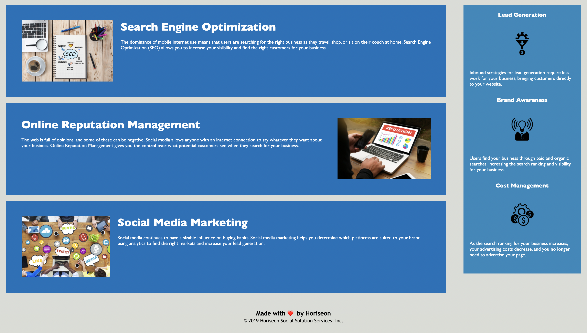

# CODE REFACTORING 

The HTML and CSS files contained in this project were modified to follow accesibility standars so that the site is optimized for search engines by simplifying the code, replacing non-semantic elements for semantic elements, and adding alt atritubes to the images. 

![Site link] (https://abimael1996.github.io/Refactoring-H-1/)

